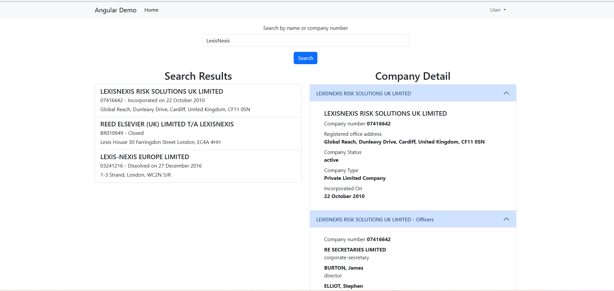

# Angular Test for Relx

## Requirements

This project was built using the following:
- [Node.js] (https://nodejs.org/) Version 20
- [Angular CLI] (https://angular.dev/) Version 18 `npm install -g @angular/cli`

### To Install
```sh
git clone [https://github.com/markjercoates/relx-angular-test]
cd relx-angular-test\angulardemo
npm install
```
### To Run
- Run npm start
- Go to http://localhost:4200/ and the home page should be displayed with the company search box.
- If a CORS error happens on a search then do the following:
- Open a command prompt in the installation folder for the Chrome Browser:
- On Windows: "C:\Program Files\Google\Chrome\Application"
- Run the following command:
- "chrome.exe --user-data-dir="C:/Chrome dev session" --disable-web-security"

### Development
Run the following command for a development server:
```sh
ng-serve
```
## Content
The project consists of the following pages:
- Auth\Login
- Home
- NoContent

The Home page contains the Company Search and Company Detail components.

### Packages
-  [Bootstrap 5](https://getbootstrap.com/) and [ng-bootstrap](https://ng-bootstrap.github.io/) components

## Preview


# AngularDemo

This project was generated with [Angular CLI](https://github.com/angular/angular-cli) version 18.2.3.

## Development server

Run `ng serve` for a dev server. Navigate to `http://localhost:4200/`. The application will automatically reload if you change any of the source files.

## Code scaffolding

Run `ng generate component component-name` to generate a new component. You can also use `ng generate directive|pipe|service|class|guard|interface|enum|module`.

## Build

Run `ng build` to build the project. The build artifacts will be stored in the `dist/` directory.

## Running unit tests

Run `ng test` to execute the unit tests via [Karma](https://karma-runner.github.io).

## Running end-to-end tests

Run `ng e2e` to execute the end-to-end tests via a platform of your choice. To use this command, you need to first add a package that implements end-to-end testing capabilities.

## Further help

To get more help on the Angular CLI use `ng help` or go check out the [Angular CLI Overview and Command Reference](https://angular.dev/tools/cli) page.
